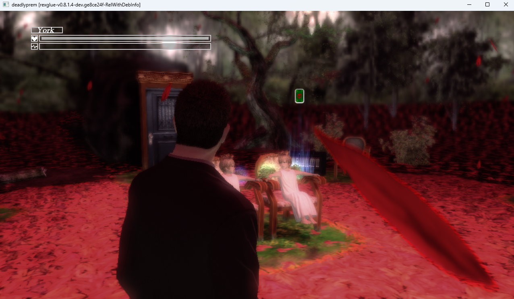

<div align="center">

# DPRecomp

**Deadly Premonition** (Xbox 360, 2010) — natively recompiled for Windows.

[](https://github.com/LittleBitUA/DPRecomp/releases/latest)
[](https://github.com/LittleBitUA/DPRecomp/releases)
[](LICENSE)
[](https://github.com/LittleBitUA/DPRecomp/releases/latest)
[](https://github.com/LittleBitUA/DPRecomp/stargazers)



### [⬇  Download the latest release](https://github.com/LittleBitUA/DPRecomp/releases/latest)

</div>

---

## What is this

DPRecomp is a **static recompilation** of *Deadly Premonition*'s Xbox 360 executable to native Windows. The PowerPC code in the original `default.xex` is translated to C++ at build time, then linked against a host runtime that emulates the Xbox 360 ABI (CPU registers, kernel objects, threading, GPU command processor + EDRAM). The result is a regular Windows process — **no emulator, no JIT, no per-frame instruction dispatch overhead**.

Because the game logic runs natively, CPU-side behaviour (dialogue advance, script timing, threading) is unaffected by the bugs that plague Deadly Premonition under Xenia (chapter-1 hardlocks, broken dialogue advance). And because the renderer is the upstream Xenia D3D12 stack, GPU output matches xenia-canary visually — with the rainbow-noise artifact on hair/foliage **fixed at the SDK level**.

Built on the [ReXGlue SDK](https://github.com/rexglue/rexglue-sdk).

> [!IMPORTANT]
> This repository contains **no game code, data, or assets**. You must own a legal copy of *Deadly Premonition* (Xbox 360) and provide your own dumped `default.xex` and game data tree.

---

## Status

| Subsystem | State |
| --- | --- |
| CPU recompilation | **Stable** — full playthrough verified by external testers (driving, walking, cutscenes) |
| GPU — D3D12 | **Working** — rainbow-noise artifact fixed ([investigation log](docs/gpu-rainbow-noise.md)) |
| Audio (XAudio2) | Working |
| Input — keyboard + mouse | Working (PC-style Director's Cut bindings preconfigured) |
| Input — gamepad | Working (DualSense tested) |
| Save / load | Working |
| Subtitles / dialogue | Working — English |

Externally confirmed **2026-06-18**: people are completing the game end-to-end and enjoying it. The project is in maintenance mode — patches go in when something surfaces.

---

## Quick start

1. **Download** the latest release zip: [v0.1.1 →](https://github.com/LittleBitUA/DPRecomp/releases/latest)
2. **Extract** it somewhere with read/write access.
3. **Drop your legally-owned game files** into the `assets/` folder next to `deadlyprem.exe`. The expected layout:

   ```
   deadlyprem.exe
   rexruntimerd.dll
   deadlyprem.toml      ← rename from deadlyprem.toml.sample
   assets/
     default.xex
     nxeart
     updata/
     ...
   ```

4. **Rename** `deadlyprem.toml.sample` → `deadlyprem.toml`. It already enables mouse mode and ships PC-style Director's Cut bindings.
5. **Launch** via `start.bat`, or:

   ```powershell
   deadlyprem.exe --game_data_root assets
   ```

Press `F4` in-game for the settings overlay (cvars, key binds, sensitivity).
Press `` ` `` (backtick) for the console.

---

## Default controls (PC Director's Cut style)

| Action | Key |
| --- | --- |
| Move | `W` `A` `S` `D` |
| Camera | Mouse |
| Interact / fire | `E` / `LMB` |
| Run | `Shift` |
| Light on/off | `F` |
| Strafe left / right | `Z` / `X` |
| Hold breath / lock on | `Ctrl` |
| Look / draw weapon | `Space` |
| Reload / cancel | `R` |
| Map | `M` |
| Pause | `Enter` |
| Switch weapon | Mouse wheel |
| Settings overlay | `F4` |
| Console | `` ` `` |

See [`CONTROLS_EN.txt`](https://github.com/LittleBitUA/DPRecomp/releases/latest) inside the release zip for the full list.

---

## Building from source

<details>
<summary><b>Click to expand — full build instructions</b></summary>

### Prerequisites

- Windows 11
- Visual Studio 2022 Build Tools with the C++ workload (or full IDE)
- LLVM/Clang 20 or newer
- CMake 3.25 or newer
- Ninja 1.11 or newer
- A built and installed [ReXGlue SDK](https://github.com/rexglue/rexglue-sdk), registered in CMake's user package registry. The SDK must be built in the same configuration the consumer project uses (Debug or RelWithDebInfo).

### Provide the game

Drop the contents of your Xbox 360 disc dump into `assets/`:

```
assets/
  default.xex
  nxeart
  updata/
    readfile.dir
    readfile.tbl
    readfile_en.dir
    ...
```

### Build

```powershell
# Source the MSVC environment once per shell so clang can find the headers
& 'C:\Program Files (x86)\Microsoft Visual Studio\2022\BuildTools\VC\Auxiliary\Build\vcvars64.bat'

cmake --preset win-amd64-relwithdebinfo
cmake --build --preset win-amd64-relwithdebinfo --target deadlyprem_codegen
cmake --build --preset win-amd64-relwithdebinfo --parallel 6
```

Codegen produces ~4.45M lines of recompiled C++ in `generated/default/`. First build takes 20-30 minutes; incremental builds after config tweaks are much faster.

### Run

```powershell
cd out\build\win-amd64-relwithdebinfo
.\deadlyprem.exe --game_data_root assets
```

If `assets/` is not next to the executable, create a junction:

```powershell
New-Item -ItemType Junction -Path out\build\win-amd64-relwithdebinfo\assets `
  -Target (Resolve-Path .\assets)
```

### Discovering missing functions

When the runtime fatals with `Call to invalid or unregistered function at guest address 0xADDR`, add an entry under `[functions]` in `deadlyprem_config.toml`:

```toml
"0xADDR" = { name = "sub_ADDR" }
```

For batch discovery, use [`sp00nznet/360tools`](https://github.com/sp00nznet/360tools):

```powershell
python tools/extract_pe.py assets/default.xex generated/dp_pe.bin
python tools/find_missing_vtable_funcs.py generated/dp_pe.bin generated/default/deadlyprem_init.cpp
```

The scanner output is paste-compatible with `[functions]` after a trivial case fix (`0X` → `0x`).

</details>

---

## Project structure

- `deadlyprem_manifest.toml` — top-level ReXGlue manifest; points at the XEX and pulls in `deadlyprem_config.toml`.
- `deadlyprem_config.toml` — codegen hints: manually-registered functions, templates for switch tables and midasm hooks.
- `src/deadlyprem_app.h` — `rex::ReXApp` subclass; installs the FP exception guard at start, removes it at shutdown.
- `src/deadlyprem_fp_guard.h` — VEH (Windows) / SIGFPE (POSIX) handler that masks SSE FP exceptions raised by the recompiled guest code.
- `src/deadlyprem_hooks.cpp` — bodies for any named functions and midasm hooks declared in the TOML.
- `src/main.cpp` — `REX_DEFINE_APP` entry point.
- `scripts/build.py` — wraps codegen + configure + build into one command.

---

## Technical deep-dives

- 📜 [GPU rainbow-noise investigation log](docs/gpu-rainbow-noise.md) — the full forensic trail of how the EDRAM ownership-transfer artifact was found and fixed, including 7 disproved hypotheses kept as "do not re-bisect" notes.

---

## Credits

- [ReXGlue SDK](https://github.com/rexglue/rexglue-sdk) — the recompilation toolkit.
- [EternalSonataReprise](https://github.com/birabittoh/EternalSonataReprise) — the host-glue template that this project's `src/` follows, including the FP exception guard pattern.
- [`sp00nznet/360tools`](https://github.com/sp00nznet/360tools) — Python scanners for batch vtable / switch-table / import discovery.
- [Xenia project](https://github.com/xenia-canary/xenia-canary) — the upstream GPU stack that ReXGlue's `src/graphics/` ports in.
- [Weighted Coils](https://www.youtube.com/@WeightedCoils) — testing and end-to-end playthrough validation.

---

## Legal

The host-side source under `src/`, build scripts, CMake files, TOML configs, and documentation are released under the **MIT License** — see [LICENSE](LICENSE).

The recompiled game code produced at build time contains symbols and logic from *Deadly Premonition* and is **not** redistributable. Do not share `assets/default.xex`, the `generated/default/` directory, or any built binary that links against them.
