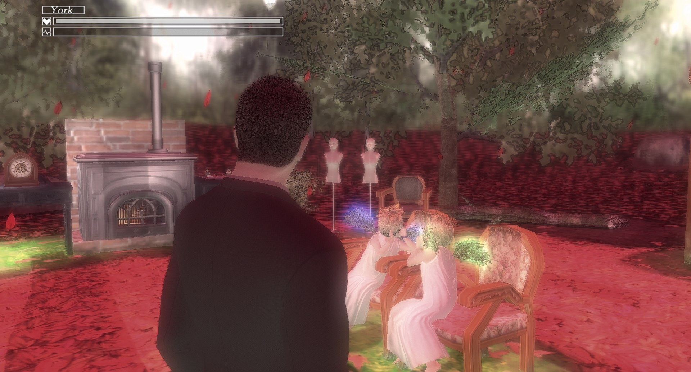
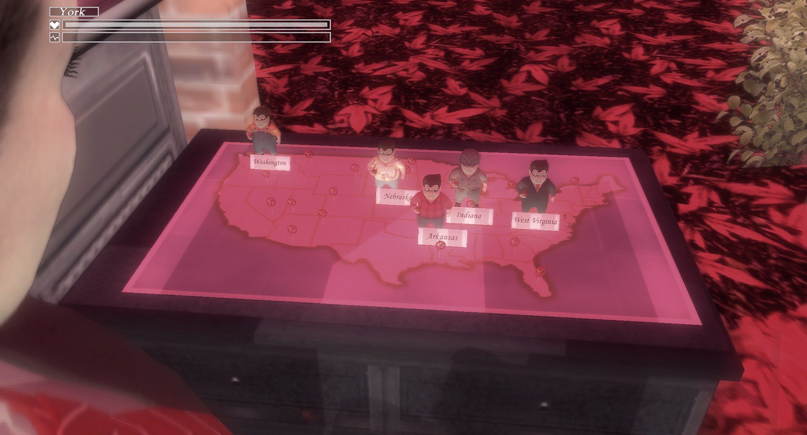
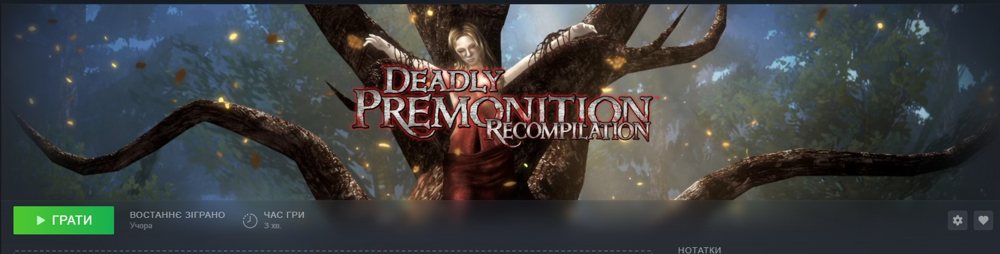

# Deadly Premonition Recompilation

**A native Windows port of *Deadly Premonition* (Xbox 360, 2010) by static recompilation. No emulator.** 
60 FPS on the console's own time base · real mouse look · keyboard and PlayStation button prompts · FSR 3 and 2× supersampling · a launcher that updates itself · PAL and USA discs

## [⬇ &nbsp;Download 1.4.7 for Windows](https://github.com/LittleBitUA/DPRecomp/releases/download/v1.4.7/DPRecomp-1.4.7-win64.zip)

`DPRecomp-1.4.7-win64.zip` · 42 MB · Windows 10 / 11 64-bit

[Release notes](docs/RELEASE-NOTES-1.4.7.md) · [Steam artwork pack](https://github.com/LittleBitUA/DPRecomp/releases/download/v1.3.0/DPRecomp-Steam-artwork.zip) · [Report a bug](https://github.com/LittleBitUA/DPRecomp/issues/new) · [Changelog](docs/CHANGELOG.md)

**by the «Little Bit» team &nbsp;·&nbsp; 🇺🇦 MADE IN UKRAINE**

---

> [!IMPORTANT]
> **You provide your own legally-owned copy of the game** (PAL or USA Xbox 360 disc, as an `.iso` or extracted files). The release contains the host program only: no `default.xex`, no game data. See [Legal](#legal).

## At a glance

| | |
|---|---|
| ⏱️ **60 FPS the right way.** The logic tick is unlocked from the 30 FPS vblank gate and fed whole ticks with an error accumulator, exactly like the console counts vblanks. Cutscenes stay in sync with the voices. Switchable. | 🖱️ **Real mouse look.** Mouse motion drives the game's own camera code: walking, aiming, driving and cutscene cameras. No stick emulation, no dead zone, no acceleration curve. Sensitivity and Y-invert in the launcher. |
| ⌨️ **The prompts speak keyboard.** The A / B / X / Y / LB / RB icons become pictures of *your* keys, generated from your bindings. Or PlayStation glyphs for DualShock / DualSense players. | 🎮 **Every controller.** Xbox, DualShock 4, DualSense (adaptive triggers: weapon click, resistance), any XInput or SDL pad, plus a keyboard layout that mirrors the PC Director's Cut. |
| 🖼️ **2× supersampling on the fast ROV path**, AMD FSR 3 + FXAA presenter (or CAS, FSR 1, bilinear), anisotropic filtering, window / monitor / VRR settings. A **native Direct3D 12 renderer** is in preview next to the emulated path, with its own internal resolution up to 4×. | 🚀 **A launcher.** `PlayDeadlyPremonition.exe`: every setting in five tabs, English and Ukrainian, first-run `.iso` installer, one-click updates from GitHub, config self-healing. |
| 🌍 **Both regions.** The zip holds a recompiled build for the European (PAL) and the USA (NTSC) disc; the launcher picks the right one from your `default.xex`. | 🧩 **Modding built in.** Every texture is addressable by a stable hash: dump it, edit the PNG, drop it back. That is how the key prompts and the *Recompilation* title logo are done. |
| 💾 **Portable.** Unzip anywhere; saves, config and the shader cache live in the game folder. Runs on SSE4.1-era CPUs, no AVX required. | 🏆 **Achievements** are tracked locally with unlock toasts (**F7**). There is no Xbox Live. |

---

## Quick start

**You need:** Windows 10 / 11 64-bit · a Direct3D 12 GPU with rasterizer-ordered views (NVIDIA GTX 900+, AMD RX 400+, Intel Arc; recent integrated graphics at 1×) · ~6 GB free for the game data · your *Deadly Premonition* Xbox 360 disc image or extracted files.

1. **Download** [`DPRecomp-1.4.7-win64.zip`](https://github.com/LittleBitUA/DPRecomp/releases/download/v1.4.7/DPRecomp-1.4.7-win64.zip) and unzip it anywhere outside *Program Files*.
2. **Game data:** either start the launcher and let the built-in installer extract your `.iso` into `assets\` (a few minutes, resumable), or copy the extracted disc contents so that `default.xex` ends up at `assets\default.xex`.
3. **Play:** run `PlayDeadlyPremonition.exe` and press **PLAY**. The first launch compiles shaders for a minute; later launches are instant. Saves live in `userdata\` next to the game.

Updating: the launcher shows an *Update available* banner and installs the new version in place, keeping your saves and settings; since 1.3.3 this works under Proton on the Steam Deck too (one manual unzip to get onto 1.3.3, the button from then on).

---

## What's new

**1.4.7 — the native renderer preview stops blurring everything.** Off by default; the emulated path is unchanged. **Please try it and tell us how it runs** (see *Help us test* below).

- **Depth of field works.** The whole picture was evenly blurred, York included. The renderer cleared a render target on every resolve that carried the flag `0x10`, which we had read as "clear"; it is `D3DRESOLVE_FRAGMENT0`, the MSAA sample select the XDK fills in by itself. Deadly Premonition never clears on resolve, and its light pass relies on that: the depth that drives the blur survives two resolves in the same buffer. Now it does, and the background is soft while York and everything near him are sharp.
- **2× and higher internal resolution no longer wrecks the picture.** Six pixel shaders (depth of field, edges, the post chain and the local-light shadow mask) read the pixel position, and at 2× it came in host pixels while the game's constants expect console pixels.
- **Triangle fans are drawn** instead of skipped, so the small missing pieces of geometry are back.
- **Less CPU per frame:** shader constants are uploaded only when the game changes them, and the root signature is bound once per frame.
- Measured on an RTX 5070 at 2× in the Red Room: 60 fps held, the native renderer's CPU time 3.1–3.3 ms and GPU time 1.2–1.3 ms per frame.

[Full notes](docs/RELEASE-NOTES-1.4.7.md).

| Red Room | The map table |
|---|---|
|  |  |

*The native renderer in 1.4.7 at 2× internal resolution: depth of field as on the console.*

**1.4.6:** native renderer preview: internal resolution up to 4×, mipmaps, the console's shadow depth format and colour range, a recompiler fix for conditional shader branches. [Notes](docs/RELEASE-NOTES-1.4.6.md).

**1.4.5:** settings labels no longer wrap into a clipped second line; long explanations are tooltips (#32). [Notes](docs/RELEASE-NOTES-1.4.5.md).

**1.4.4:** Audio Output (Auto / Stereo / Surround). Stereo fixes quiet or missing dialogue when Windows is set to 5.1 but the speakers are not (#19). [Notes](docs/RELEASE-NOTES-1.4.4.md).

**1.4.3:** the launcher's *Share Shader Cache* never actually delivered anything; it does now. [Notes](docs/RELEASE-NOTES-1.4.3.md).

**1.4.2:** the endless "Saving" screen (#21), diagonal mouse aim (#30), and the first native renderer preview. [Notes](docs/RELEASE-NOTES-1.4.2.md).

Everything since 1.0, version by version: [docs/CHANGELOG.md](docs/CHANGELOG.md).

---

## 🧪 Help us test

Every fix in the list above started as somebody's report. What is most useful right now:

- **The native renderer preview** (launcher → **Native**), now that 1.4.7 fixed the blur. It is incomplete on purpose, and hardware other than ours is the part we cannot see. Tell us your GPU and CPU, the frame rate in the same spot with the renderer off and on, and whether **Internal Resolution** 2× is playable. The log line that starts `Native renderer: frame #` carries the frame, CPU and GPU milliseconds we need; attach `logs\deadlyprem_XXX.log`.
- **60 FPS oddities:** anything that runs at the wrong speed or desyncs from the voices. The scene where York meets Emily and George is our reference.
- **The ROV path's leftovers:** hard contours on tree crowns and glass, light-blue polygonal patches on characters in dialogue scenes, flat cloud blotches (#10). A screenshot plus the scene name.
- **Steam Deck and AMD integrated graphics:** frame rates with ROV vs RTV, 1× vs 2×.
- **Crashes:** GPU and driver, render path, internal resolution, a screenshot, the newest `logs\deadlyprem_XXX.log` and any `logs\*.dmp` next to it. The log ends with a crash report: the game thread, the call stack, and for GPU losses the DRED breadcrumbs.

Open an [issue](https://github.com/LittleBitUA/DPRecomp/issues/new) with a save file if the problem is scene-specific (`userdata\` → the folder for your XUID). "It works" reports with your GPU and settings are welcome too. And if you say yes when the launcher asks to **share your shader cache**, whoever plays after you gets fewer first-time stutters ([what exactly is sent](#faq)).

---

## The launcher and in-game keys

`PlayDeadlyPremonition.exe` shows every setting on its own page: **Graphics** (render path, internal resolution, upscaler and sharpness, FXAA, 60 FPS, window, monitor list), **Advanced** (game language, skip intro, GPU adapter, texture cache, audio output, Steam overlay switch, shader cache sharing, texture dump), **Mouse** (direct camera control, sensitivity, invert, key stick ramp, auto-shake), **Controls** (button prompts style, controller layout, DualSense triggers, every key binding), **Debug** (log level, PSO policy), **Experimental** and **Native** (the native renderer preview and its internal resolution). It writes `deadlyprem.toml` next to the game and repairs keys the in-game overlay may drop.

In the game: **F4** runtime settings overlay (live changes, *Save to config* writes them back) · **F3** performance overlay · **F7** achievements.

## Controls

Mirrors the Director's Cut PC keymap. A controller works at the same time. The publisher logos can be skipped (Advanced → Skip Intro: straight to the title screen, or straight to the main menu). Rebind anything in the launcher (Controls tab); combo syntax in the config: `,` separates alternatives, `+` means held together (`keybind_a = "E,Space+LMB"`).

| Action | Keyboard / mouse | Pad |
|---|---|---|
| Move | `W` `A` `S` `D` | Left stick |
| Look | Mouse | Right stick |
| Change weapon | Mouse wheel | D-pad up / down |
| Map zoom | Mouse wheel | Right stick up / down |
| Interact / accept | `E` | A |
| Cancel / reload | `R` | B |
| Observe | `C` | Left stick press |
| Flashlight | `F` | Y |
| Run (hold) / cutscene actions | `Shift` | X |
| Draw weapon / aim | hold `Space` | Right trigger |
| Aim (while weapon drawn) | Mouse (or `W` `A` `S` `D`) | Left stick |
| Fire | `Space` + `LMB` | A while aiming |
| Shake the stick (QTE "Get it off!") | tap `A` `D` `A` `D` rapidly | wiggle the left stick |
| Hold breath / lock-on | `Control` | Left trigger |
| *Director's Cut layout* (Controls → Controller Layout) | unchanged | Left trigger aims, right trigger fires, A while aiming holds breath |
| Strafe left / right | `Z` / `X` | LB / RB |
| Pause menu | `Enter` | Start |
| Map | `M` | Back |

## Steam

Add `PlayDeadlyPremonition.exe` as a non-Steam game, then apply the [Steam artwork pack](https://github.com/LittleBitUA/DPRecomp/releases/download/v1.3.0/DPRecomp-Steam-artwork.zip) (also in [docs/steam](docs/steam)): a 600×900 vertical capsule, a 1920×620 hero banner and a transparent logo, with a README that says where each file goes. Step by step in the [FAQ](#how-do-i-add-the-game-to-steam-with-proper-artwork). If starting through Steam gives a black screen or a tinted quarter frame, set *Steam Overlay* to `off` in the launcher (Advanced).

## Keyboard prompts and texture modding

The game draws its button hints from one small atlas texture. With *Mouse & Keyboard Mode* on, the launcher paints key caps with your bindings over that atlas, so **E** Save, **R** Observe, **SHIFT** run, **SPACE** aim follow your keymap. Controls → **Button Prompts** picks the style: **Keyboard**, **Xbox** (original) or **PlayStation** in three looks (icons by [Zacksly](https://zacksly.itch.io), CC BY 3.0). The sets live in `prompts\` as plain PNGs, so another controller family is a folder away.

The same mechanism is a modding tool. Every texture the game loads is identified by a hash of its pixels, the same on every PC:

- `textures\<hash>.png` replaces the texture completely (any size; mipmaps are generated).
- `textures\<hash>.overlay.png` is composited on top of the original where the PNG is opaque, so you ship only the pixels you changed.
- Launcher → Advanced → **Texture Dump** writes every texture the game loads to `textures\dump\<hash>_<width>x<height>_<format>.png` while you play. Turn it off afterwards.

DXT1/3/5 and RGBA8 textures are dumped; float and depth formats are skipped. Code: `docs/sdk-patches/new-files/src/graphics/pipeline/texture/replacement.cpp` and `GenerateKeyPromptOverlay` in `launcher/src/main.cpp`.

---

## FAQ

<b>Is this an emulator?</b>

No. An emulator runs Xbox 360 instructions on a virtual CPU at runtime. Here the instructions were converted to native x86-64 code once, at build time, by *static recompilation*: the same technique as [N64: Recompiled](https://github.com/Mr-Wiseguy/N64Recomp), [Skate 3 Recomp](https://github.com/Sergeanur/Skate3Recomp) and the author's [Silent Hill: Downpour port](https://github.com/LittleBitUA/DownpourRecomp). The GPU is still *translated* (Xenos → Direct3D 12) by the [ReXGlue](https://github.com/rexglue/rexglue-sdk) runtime, a Xenia-derived host, which is why the settings overlay looks familiar to Xenia users.

<b>How do I add the game to Steam, with proper artwork?</b>

Steam → *Games* → *Add a Non-Steam Game to My Library* → *Browse...* → pick `PlayDeadlyPremonition.exe` from your DPRecomp folder, and name the entry *Deadly Premonition Recompilation*. Then download the [Steam artwork pack](https://github.com/LittleBitUA/DPRecomp/releases/download/v1.3.0/DPRecomp-Steam-artwork.zip): right-click the game in the library grid → *Manage* → *Set custom artwork* → `grid.png`; on the game's page right-click the banner → *Set custom background* → `hero.png`, and right-click the logo area → *Set custom logo* → `logo.png` (drag it to the centre). The README inside the pack also has the file-based way (`userdata\<id>\config\grid`).

<b>Does the USA (NTSC) version work?</b>

Yes. The USA disc ships a different executable, so the zip contains two recompiled builds: `deadlyprem.exe` for PAL and `deadlyprem_usa.exe` for USA. The launcher and the installer start the right one from the size of your `default.xex`; you never have to choose.

<b>Is 60 FPS safe?</b>

It changes the game's time base rather than just doubling the frame rate, so animation, physics and the clock run at normal speed. Since 1.3 the game gets whole logic ticks with an error accumulator, exactly like the console's vblank count: 1, 1, 1, ... and a 2 every few hundred frames, so long cutscenes stay in sync with the audio and scripted scenes never see fractional ticks. The doubled sounds and prop swaps reported at 60 FPS (#17, #18) went away with that change and are closed. If something time-related still misbehaves, switch it off (Graphics → *60 FPS*) and open an issue with the location.

<b>The mouse feels different from a PC shooter.</b>

Mouse motion drives the game's own camera, a spring-damped orbit camera by design: it eases towards where you point and re-centres behind York while you walk. The hook keeps the angle you asked for until the camera gets there and turns the yaw state directly. Tune *Camera Hook Sensitivity* (radians per pixel) and *Hold Before Auto-center* in the launcher's Mouse tab; *Direct Yaw* off gives the game's spring back. Turning *Mouse Controls Camera Directly* off falls back to stick emulation.

<b>Where are my saves?</b>

`userdata\` next to `deadlyprem.exe`. Saves made with the 1.0 build in `Documents\deadlyprem` were copied there automatically by 1.1 and later. To back up or move your progress, copy the folder.

<b>The launcher asked to share my shader cache. What is sent, and why?</b>

**Why.** The runtime translates the game's Xbox 360 shaders and builds Direct3D 12 pipelines the first time it sees them, and that first time costs a stutter. Every pipeline the game has ever needed is remembered in a small storage file that ships pre-warmed with each release. One person cannot reach every scene of a 30-hour game; the players together do.

**What.** Only the two storage files from `userdata\cache\shaders\shareable\`: `*.xsh` (the game's own shader microcode, data from the disc) and `*.xpso` (pipeline descriptions, a few dozen bytes each). No saves, no settings, no user name, no hardware id. **Where to check:** one function, [`MaybeShareShaderCache()` in `launcher/src/main.cpp`](launcher/src/main.cpp), zips the two files and posts them to a project channel; [`tools/merge_shader_storage.py`](tools/merge_shader_storage.py) merges what players sent. The public source carries an empty webhook address; the release build carries the project one.

**On / off.** The launcher asks once. Later: Advanced → *Share Shader Cache*. Off means nothing is ever sent.

<b>Does it run on my old CPU?</b>

The build targets the x86-64 baseline plus SSSE3 / SSE4.1: any Intel Core from 2008 or AMD from Bulldozer (2011) onwards. No AVX or AVX2 is required.

<b>Something crashed or looks wrong. What do I do?</b>

Open an issue with: your GPU and driver, whether the render path is ROV or RTV, the internal resolution, a screenshot, and the newest file from `logs\`. Please try `Internal Resolution Scale = 1x` and `Render Target Path = RTV` first and say whether that changed anything.

<b>Can I replace textures / make an HD pack?</b>

Yes. Turn on *Texture Dump* in the launcher (Advanced), play, pick the PNG from `textures\dump\`, edit it and save it as `textures\<hash>.png` (full replacement) or `textures\<hash>.overlay.png` (only your opaque pixels are applied). Any size works. See [Keyboard prompts and texture modding](#keyboard-prompts-and-texture-modding).

---

## Known issues

**The emulated path (default):**

- **Terrain layer blending** shows hard triangle edges while walking and blends correctly when standing still (long-standing, under investigation).
- Some dialogue scenes show **light-blue polygonal patches on characters** with the ROV path (the scene's fog colour through the composite mask).
- Clouds in some outdoor scenes render as flat blotches with hard edges (#10).
- **2× internal resolution:** the game's glow, depth of field and the sun's halo are computed in buffers sized for 1×, so bright edges can show a fine grid and the blur is softer than the original. 1× does not have it.
- Shadows only appear on nearby casters (#25); this is how the game builds its cascades and is probably the console's behaviour, but it is not verified against hardware yet.
- Linux is not supported yet.

**The native renderer preview (off by default):**

- The mirror floor in the sheriff's station comes out white, and outdoors the picture has a milky veil over it. Same root cause, still open.
- Shadows slide with the character instead of staying put (not re-checked since the resolve fix in 1.4.7; reports welcome).
- Tree crowns and bushes show thin dark contour lines.

---

## Building from source

<b>Click to expand</b>

1. Install Visual Studio 2022 Build Tools, LLVM/Clang 18+, CMake 3.25+ and Ninja.
2. Build and install the ReXGlue SDK (0.10 nightly, `development` branch) with the local patches from [`docs/sdk-patches`](docs/sdk-patches) (a tracked diff plus new files): `cmake --preset win-amd64 -DREXGLUE_ENABLE_FIDELITYFX=ON`, then build and install the `Release` and `RelWithDebInfo` configurations.
3. Put your PAL `default.xex` into `assets\` and run the recompiler: `rexglue codegen deadlyprem_manifest.toml` (about 10 seconds; the function list and the mid-asm hooks live in `deadlyprem_config.toml`, the USA build in `usa\`).
4. Configure with `cmake --preset dp-relwithdebinfo` (uses `CMakeUserPresets.json` to point at your SDK install) and build. The default build is the compatibility (SSE4.1) build; `-DDP_ENABLE_X86_64_V3=ON` enables AVX2.
5. The launcher is a separate CMake project in `launcher\` (Visual Studio generator).

---

## How this is made: a human and an AI

This port is developed with an AI: **Claude** by Anthropic, through Claude Code. It writes most of the code you see here, the SDK patches, the mid-asm hooks, the launcher, and it is honest to say so. It is not "AI, run this game for me". A recompilation cannot be prompted into existence; it is weeks of the same loop, done by a person:

- **Capturing what the game really does** in RenderDoc, draw by draw. That is how the sky staircase was traced to 2 bits of alpha, and the rainbow noise to a render target format switch.
- **Reading the game's code** in Ghidra and in the recompiled listings: the frame limiter constants, the seventeen camera routines, the animation event dispatcher, with the PC port's decompilation as a cross-reference.
- **Playing every build.** Each change is built, deployed and played; "the mouse feels slow", "Shift freezes York", "the cutscene runs fast" were seen at the keyboard first, and fixes that looked right in code and wrong on screen were thrown away.
- **Deciding** what ships, what stays default-off, what is rolled back.

The AI reads thousands of lines of runtime and game listings faster than a person can, ports patches between projects, keeps the launcher, docs and both regional builds consistent, and writes the tedious parts without getting tired. The human brings the game, the tools, the eyes and the judgement. Pull requests are read by a person, tested on a real machine, and credited to you.

---

## Credits and thanks

**First of all, to the people who made the game.** *Deadly Premonition* is the work of **Hidetaka "Swery" Suehiro** and the team at **Access Games**, published by Rising Star Games, Ignition Entertainment and Marvelous. Greenvale, York, Zach, the coffee, the rain: none of this exists without them. This project is a way of keeping that game playable, and it is made with respect for their work. Please buy the game.

- **«Little Bit»** — the team behind the port: the recompilation, the launcher, the SDK fixes. Made in Ukraine.
- **[ehw](https://github.com/ehw/game-patches)** — the 60 FPS patch (originally for Xenia), the starting point of the 60 FPS path.
- **[Alexbeav](https://github.com/Alexbeav)** — the first-run disc image installer (contributed to DownpourRecomp, ported here).
- **[ReXGlue](https://github.com/rexglue/rexglue-sdk)** and **[Xenia](https://xenia.jp/)** — the runtime this port stands on; **[XenonRecomp](https://github.com/hedge-dev/XenonRecomp)** and the recompilation projects that showed the way.
- **[DPfix](https://github.com/PeterTh/dpfix)** by Peter Thoman — invaluable notes on how the game renders.
- **[miniz](https://github.com/richgel999/miniz)** (MIT) — the zip reader inside the launcher's updater.
- **[Zacksly](https://zacksly.itch.io)** — *PS5 Button Icons and Controls*, the PlayStation prompt icons ([CC BY 3.0](https://creativecommons.org/licenses/by/3.0/), resized, otherwise unmodified; `prompts/LICENSE-zacksly.txt`).
- **The testers.** SilentHeII, Crowley9, Dominus41, DexgamingX, GradiusHead and everyone who filed an issue, sent a save, a log or a DebugView capture: the black screen under Steam recording, the audio desync, the doubled sounds, the coffee cup, the morgue, the Steam Deck updater. Each one became a fix or is on its way to one.

---

## Legal

This repository contains no game code, assets or data. You must own *Deadly Premonition* for Xbox 360 and provide your own disc image or extracted files. *Deadly Premonition* is © Access Games / Rising Star Games / Marvelous. This project is not affiliated with or endorsed by them, Microsoft, Valve, or the ReXGlue authors.
