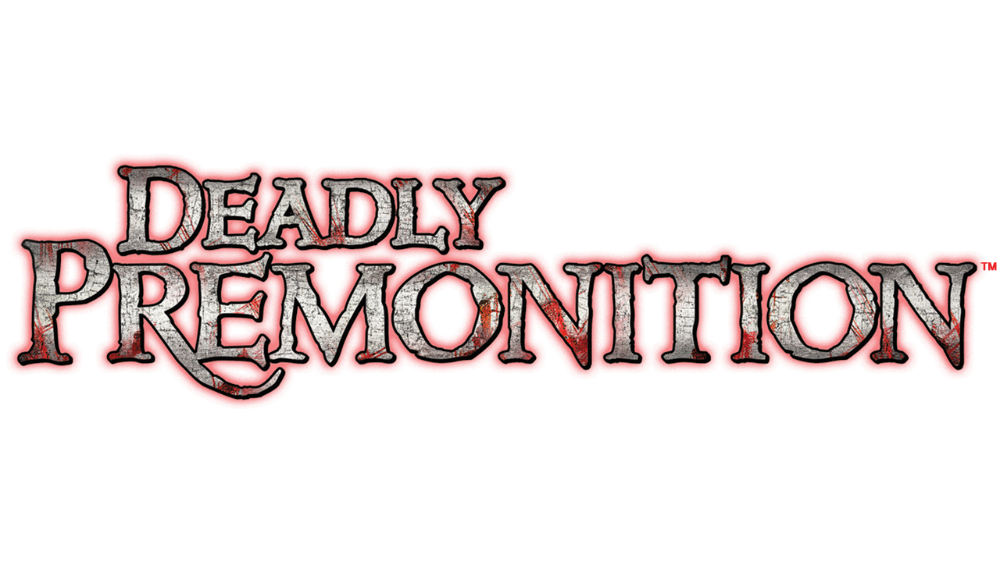
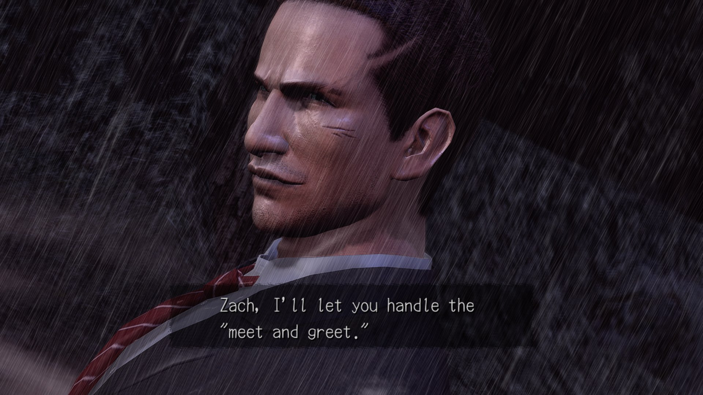
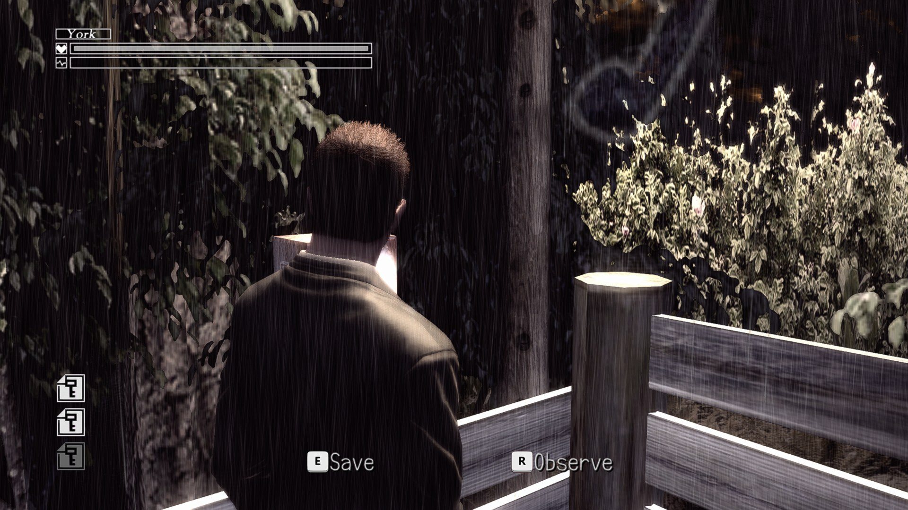
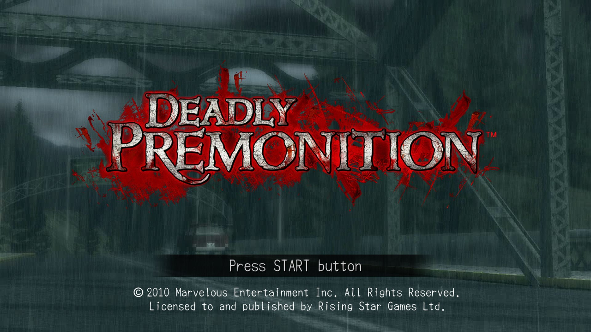
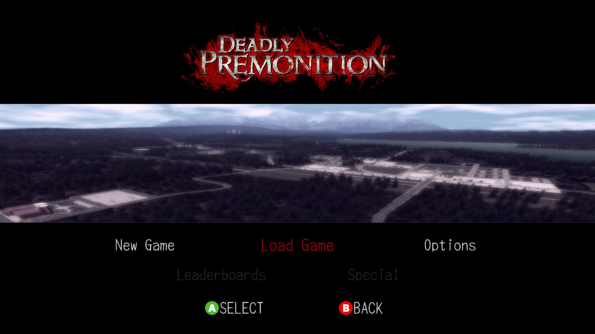
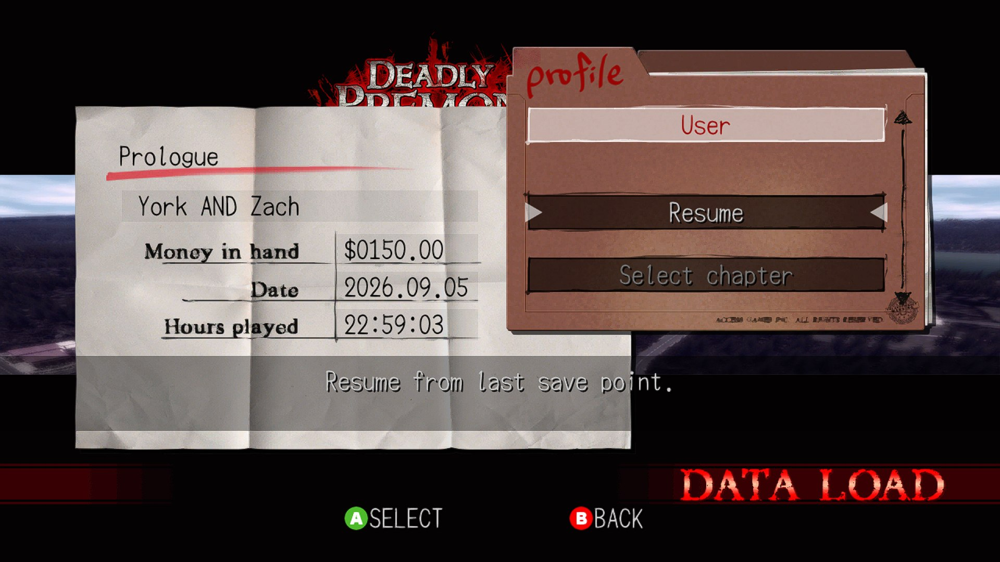
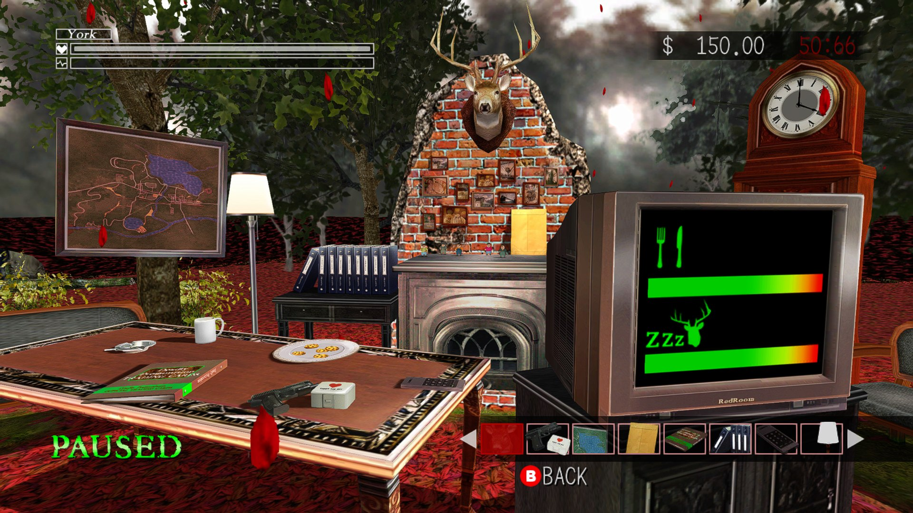
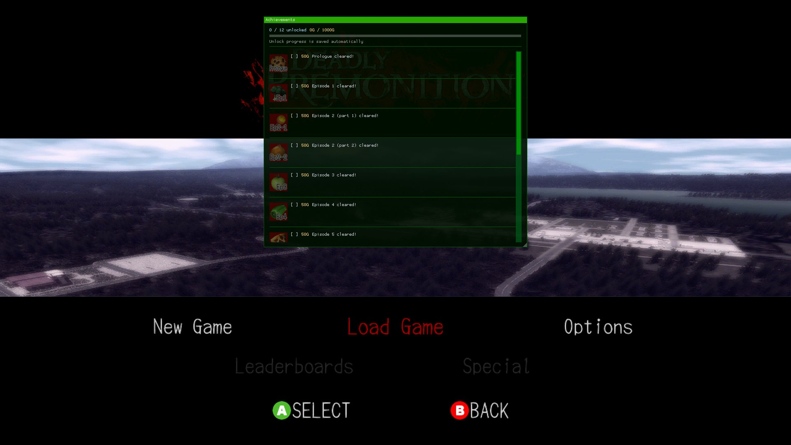

# Deadly Premonition Recompilation

### Play *Deadly Premonition* natively on Windows: 60 FPS, real mouse look, a launcher, DualSense triggers, FSR 3 — no emulator required.

## [⬇  Download 1.1 for Windows](https://github.com/LittleBitUA/DPRecomp/releases/latest)

**by «Little Bit» — Dmytro Bidlov**

**🇺🇦 MADE IN UKRAINE**

---

> [!IMPORTANT]
> **1.1 (September 2026)** fixes the reports that came in after 1.0: the mouse now aims too, holding Shift runs instead of freezing York, the 60 FPS patch no longer drifts cutscene animation away from the audio, saves and the shader cache really live next to the game (migrated from Documents automatically), and the shader/PSO cache finally accumulates, with a visible compile indicator. Details in [What's new in 1.1](#whats-new-in-11).
>
> **Next update (in testing now): keyboard and PlayStation button prompts.** The game's A / B / X / Y / LB / RB / LT / RT icons are replaced by pictures of *your* keys, generated by the launcher from your key bindings, or by PlayStation glyphs for DualShock / DualSense players — see [Keyboard prompts and texture modding](#keyboard-prompts-and-texture-modding). The same mechanism lets anyone swap any texture in the game with a PNG.
>
> **1.0 is a full restart of the project.** The old v0.1.1 preview was built on an outdated SDK and is superseded in every respect: new runtime, new GPU plugin, new launcher, new input. If you still have v0.1.1, delete it and start fresh — the launcher, the config file and the save location have all changed.
>
> **Regions:** both the **European (PAL)** and the **USA (NTSC)** Xbox 360 discs are supported. The zip contains a recompiled build for each; the launcher picks the right one from your `default.xex`.

---

## Table of contents

- [What is this?](#what-is-this)
- [Keyboard prompts and texture modding (next update)](#keyboard-prompts-and-texture-modding)
- [What's new in 1.1](#whats-new-in-11)
- [What's new in 1.0](#whats-new-in-10)
- [Screenshots](#screenshots)
- [What you need before playing](#what-you-need-before-playing)
- [How to install and play](#how-to-install-and-play)
- [The launcher](#the-launcher)
- [Default controls](#default-controls)
- [Frequently asked questions](#frequently-asked-questions)
- [Known issues](#known-issues)
- [Building from source](#building-from-source)
- [How this is made: a human and an AI](#how-this-is-made-a-human-and-an-ai)
- [Credits](#credits)
- [Legal](#legal)

---

## What is this?

**Deadly Premonition Recompilation is a native Windows port of *Deadly Premonition* (Access Games / Rising Star Games, Xbox 360, 2010), directed by Hidetaka "Swery" Suehiro.** The Xbox 360 executable is converted into a regular Windows program once, at build time, by *static recompilation*. What you run is a real x86-64 `.exe` — there is no emulator, no JIT and no per-instruction interpretation.

It is the same technique as [N64: Recompiled](https://github.com/Mr-Wiseguy/N64Recomp), [Skate 3 Recomp](https://github.com/Sergeanur/Skate3Recomp) and the author's own [Silent Hill: Downpour port](https://github.com/LittleBitUA/DownpourRecomp). The project is built on the [ReXGlue SDK](https://github.com/rexglue/rexglue-sdk) (a Xenia-derived Xbox 360 host runtime), plus a set of game-specific fixes and hooks that live in this repository.

> [!NOTE]
> **You provide your own legally-owned copy of the game.** The release zip is the host shell only. It does not contain `default.xex`, game data, music or textures. See [Legal](#legal).

---

## Keyboard prompts and texture modding

> Ships with the next update. Already in the nightly build being played on this end.

**The prompts finally speak keyboard.** Deadly Premonition draws its button hints from one small atlas texture (A, B, X, Y, the sticks, LB/RB/LT/RT, L3/R3). When *Mouse & Keyboard Mode* is on, the launcher paints key caps with your bindings over that atlas: **E** Save, **R** Observe, **SHIFT** run, **SPACE** aim, **CTRL** for LT, and so on. Change a binding in the launcher and the pictures follow. Controls tab → **Button Prompts** picks the style: **Keyboard** (your bindings), **Xbox** (the original icons) or **PlayStation** for DualShock / DualSense players — three looks (solid, solid with ring, outline), using the *PS5 Button Icons and Controls* set by **[Zacksly](https://zacksly.itch.io)** (CC BY 3.0). The sets live in `prompts\` as plain PNGs, so another controller family is a folder away. The DATA LOAD page tabs are covered too; if you spot gamepad icons somewhere else, open an issue with a screenshot and the place — it is one line in a table to add.

**How it works, and why it is also a modding tool.** The runtime now supports host-side texture replacement. Every texture the game loads is identified by a hash of its pixels, so the id is the same on every PC and every run:

- `textures\<hash>.png` — replaces the texture completely (any size; mipmaps are generated at load). The new title logo with *RECOMPILATION* on it is exactly this.
- `textures\<hash>.overlay.png` — is composited on top of the original where the PNG is opaque, so you only ship the pixels you changed. The key caps use this.
- Launcher → Advanced → **Texture Dump** writes every texture the game loads to `textures\dump\<hash>_<width>x<height>_<format>.png` while you play. Find the one you want, edit it, drop it back under `textures\` with the hash as the file name, done. Turn the dump off afterwards — it writes big files.

The code is `rexglue-sdk/src/graphics/pipeline/texture/replacement.cpp` and `launcher/src/main.cpp` (`GenerateKeyPromptOverlay`). DXT1/3/5 and RGBA8 textures are dumped; float and depth formats are skipped.

## What's new in 1.1

- **Mouse aiming.** The aim camera (Space held) is a separate routine driven by the *left* stick with its own acceleration, which is why 1.0 aimed with WASD only. 1.1 detects that camera and feeds the mouse into the left stick while it runs.
- **Mouse look is position control now.** 1.0 nudged the camera target once per frame and the game's camera spring forgot most of it; 1.1 keeps the un-reached angle pending and also turns the yaw state directly, so a mouse move is a fixed angle. Sensitivity is in radians per pixel (default 0.003); auto-centering resumes after the mouse has been idle for `dp_mouse_camera_hold_ms`.
- **Keyboard fix:** holding Shift froze York and Control (LT) did nothing, because the key driver silenced every plain key while a modifier was held. Run = hold **Shift** (the X button); the 1.0 controls sheet wrongly listed E as run.
- **60 FPS:** the logic tick is derived from the measured frame time instead of being pinned to 1/60 s, so long cutscenes no longer drift out of sync with the voices, and the runtime sleeps with a high-resolution timer so the limiter actually holds 16.7 ms.
- **Saves and shader cache next to the game — for real.** In 1.0 the runtime kept using `Documents\deadlyprem`. 1.1 uses `userdata\` and copies your existing saves and shader storage from Documents on first launch.
- **Shader / PSO cache:** the storage never grew after its first session (fixed); driver-compiled pipelines are cached on disk (`userdata\cache\shaders\local`), and a "Preparing shaders" toast at launch plus a corner badge during play show when pipelines are being built.
- **Steam:** launcher → Advanced → *Steam Overlay* `off` for the black-screen / tinted-quarter-frame problem when starting through Steam.
- **Opt-in shader cache sharing:** the launcher asks once whether it may send your shader cache (anonymous, shader microcode and pipeline descriptions only) to the project; merged caches ship with the next release. `tools/merge_shader_storage.py` merges the collected files.
- **Steam Deck preset:** the launcher recognises a Deck (Steam sets `SteamDeck=1`; the APU reports as AMD Custom GPU 0405/0932) and applies the community-tested settings once: RTV, 1×, 2× MSAA, 16× AF, FXAA + CAS, 30 FPS, VSync, fullscreen 1280×800. Everything stays editable.
- **Keyboard stick with travel time** (60 ms to full deflection, like the PC port), so stick-shake QTEs ("Get it off!") count every A > D tap.
- Launcher, both game builds and the F3 watermark report 1.1; the launcher updates in place from GitHub.

## What's new in 1.0

Everything below is new compared with v0.1.1.

### Playability
- **60 FPS.** The game logic is unlocked from the 30 FPS vblank gate (a port of [ehw's Xenia patch](https://github.com/ehw/game-patches), issue #3), with the in-game timer kept at real time. Can be switched off in the launcher (Graphics → *60 FPS (ehw patch)*) or live in the in-game settings overlay.
- **Real mouse look.** The mouse no longer emulates an analog stick. Mouse motion is fed straight into the game's camera code (walking, aiming, driving and cutscene cameras), so there is no dead zone, no acceleration curve and no "stick" feel. Sensitivity and Y-inversion are in the launcher (Mouse tab) and in the overlay.
- **Keyboard layout of the Director's Cut PC version**, including combos (`Space + LMB` to fire while aiming) and mouse-wheel weapon switching. Every key is rebindable.
- **DualSense adaptive triggers** (PS5 controller): weapon click on the right trigger, resistance on the left, all configurable. Xbox, DualShock 4 and any XInput / SDL pad work out of the box.
- **Saves and the shader cache live next to the game** (`userdata\`), not in Documents. That also removes the OneDrive-related "save sequence never ends" soft-lock reported against v0.1.1 (issue #6).

### Graphics
- **2× supersampling (2560×1440 internal) on the fast ROV render path** — and the rainbow-noise fix for hair, foliage and glow now works on ROV as well (v0.1.1 only fixed the slow RTV path).
- **AMD FSR 3 with Native AA + FXAA** as the default presenter, sharpness adjustable, or plain bilinear / CAS / FSR 1 if you prefer.
- **No pop-in while shaders compile:** draws wait for their pipeline instead of being dropped (`block` policy), and shader/pipeline storage is pre-warmed at start.
- Anisotropic filtering, window size and monitor selection, VRR/tearing switch.

### Convenience
- **A launcher** (`PlayDeadlyPremonition.exe`): every setting in a UI (English / Ukrainian), config self-healing, **automatic updates from GitHub releases**.
- **First-run installer:** if the game data is missing, the game asks for your `.iso` and extracts it itself (Redump / XGD3 / bare partition images). Contributed to the Downpour project by [Alexbeav](https://github.com/Alexbeav) and ported here.
- Portable layout: unzip anywhere, nothing is written to your user profile.
- Runs on older CPUs: the binaries are built for the SSE4.1 baseline (no AVX/AVX2 requirement).

### Under the hood (for the curious)
- ReXGlue **0.10 nightly** with a set of local SDK changes: the 7e3 → 8888 EDRAM ownership fix for ROV (in-place compute conversion), the PSO wait policy, once-per-constant logging for invalid texture fetch constants, the mouse camera API, the overlay build stamp.
- Game hooks are done as *mid-asm hooks* generated by the recompiler (see `deadlyprem_config.toml`), so they survive regeneration.

---

## Screenshots

All captured from the 1.0 build at 2× internal resolution.

| | |
|---|---|
|  |  |
|  |  |
|  |  |

---

## What you need before playing

1. **A legally-owned copy of *Deadly Premonition* for Xbox 360 — European (PAL) or USA (NTSC) release** — as a disc image (`.iso`) or as already extracted files (`default.xex`, `nxeart`, `updata`, …).
2. **Windows 10 or 11**, 64-bit.
3. **A GPU with Direct3D 12 and rasterizer-ordered views** (NVIDIA GTX 900+ / RTX, AMD RX 400+, Intel Arc). Integrated graphics from the last few years also work, at 1× internal resolution.
4. ~6 GB of free disk space for the extracted game data.

---

## How to install and play

1. Download the latest release zip and **unzip it anywhere** (not inside *Program Files*).
2. Put your game data into the `assets` folder next to `deadlyprem.exe`:
   - **either** drop your `.iso` anywhere and start the game — the built-in installer asks for the image and extracts it into `assets` (takes a few minutes, resumable);
   - **or** copy the already-extracted disc contents (`default.xex` must end up at `assets\default.xex`).
3. Start **`PlayDeadlyPremonition.exe`** and press **PLAY** (with no game data yet, PLAY opens the installer). The launcher starts the PAL or USA build to match your disc. The first launch compiles a few shaders; later launches are instant.

Saves are stored in `userdata\` next to the game. To move or back up your progress, copy that folder.

---

## The launcher

`PlayDeadlyPremonition.exe` is the recommended way to start the game. It:

- shows every setting in five tabs — **Graphics** (render path, internal resolution, upscaler, sharpness, FXAA, 60 FPS, window / monitor), **Advanced** (game language, GPU adapter, texture cache, audio), **Mouse** (direct camera control, sensitivity, invert, keyboard key prompts), **Controls** (DualSense triggers, every key binding), **Debug** (log level, PSO policy); *Advanced* also has the **Texture Dump** switch for modders;
- writes `deadlyprem.toml` next to the game and repairs keys that the in-game overlay may drop;
- checks GitHub for a newer release on start and installs it in place with one click, keeping your config and saves.

Inside the game, **F4** opens the runtime settings overlay (live changes, `Save to config` writes them back), **F3** shows the performance overlay, **F7** shows your achievements.

---

## Default controls

Mirrors the Director's Cut PC keymap. A controller works at the same time.

| Action | Keyboard / mouse | Pad |
|---|---|---|
| Move | `W` `A` `S` `D` | Left stick |
| Look | Mouse | Right stick |
| Change weapon | Mouse wheel | D-pad up / down |
| Interact / accept | `E` | A |
| Cancel / reload | `R` | B |
| Observe | `C` | Left stick press |
| Flashlight | `F` | Y |
| Run (hold) / cutscene actions | `Shift` | X |
| Draw weapon / aim | hold `Space` | Right trigger |
| Aim (while weapon drawn) | Mouse (or `W` `A` `S` `D`) | Left stick |
| Fire | `Space` + `LMB` | A while aiming |
| Hold breath / lock-on | `Control` | Left trigger |
| Strafe left / right | `Z` / `X` | LB / RB |
| Pause menu | `Enter` | Start |
| Map | `M` | Back |

Rebind anything in the launcher (Controls tab) or in `deadlyprem.toml`. Combo syntax: `,` separates alternatives, `+` means "held together" (`keybind_a = "E,Space+LMB"`).

---

## Frequently asked questions

<b>Is this an emulator?</b>

No. An emulator runs Xbox 360 instructions on a virtual CPU at runtime. Here the instructions were converted to native code once, at build time. The GPU is still *translated* (Xenos → Direct3D 12) by the ReXGlue runtime, which is why the settings overlay looks familiar to Xenia users.

<b>Does the USA (NTSC) version work?</b>

Yes. The USA disc ships a different executable (that is why v0.1.1 failed with `No function registered at 824E9558`), so 1.0 contains two recompiled builds: `deadlyprem.exe` for PAL and `deadlyprem_usa.exe` for USA. The launcher and the built-in installer start the right one automatically from the size of your `default.xex`; you never have to choose.

<b>Is 60 FPS safe?</b>

It changes the game's time base rather than just doubling the frame rate, so animation, physics and the clock run at normal speed. Since 1.1 the logic tick follows the real frame time, so frame drops and long cutscenes stay in sync with the audio (the 1.0 build could drift, issue #12). If you ever see something time-related misbehave, switch it off (Graphics → *60 FPS (ehw patch)*) and please open an issue with the location.

<b>The mouse feels different from a PC shooter.</b>

Mouse motion drives the game's own camera, which is a spring-damped orbit camera by design — it eases towards where you point and re-centres behind York while you walk. Since 1.1 the hook keeps the angle you asked for until the camera gets there (position control) and turns the yaw state directly. Tune *Camera Hook Sensitivity* (radians per pixel, `dp_mouse_camera_sensitivity` in F4 → DP1, live) and *Hold Before Auto-center*. Turning *Mouse Controls Camera Directly* off falls back to stick emulation.

<b>Where are my saves?</b>

`userdata\` next to `deadlyprem.exe`. The 1.0 build still wrote to `Documents\deadlyprem` despite the release notes; 1.1 copies those saves (and the shader storage) into `userdata\` on its first launch and leaves the Documents copy untouched.

<b>The launcher asked to "share my shader cache". What does it send, and why?</b>

**Why it matters.** The runtime translates the game's Xbox 360 shaders and builds Direct3D 12 pipelines the first time it sees them, and that first time costs a stutter. Every pipeline the game has ever needed is remembered in a small storage file, and that file is pre-warmed and shipped with each release. One person cannot reach every scene of a 30-hour game, but the players together do — so the launcher can send your storage to the project, and the merged result ships with the next release. Whoever plays after you gets fewer first-time stutters.

**What is sent.** Only the two storage files from `userdata\cache\shaders\shareable\`: `*.xsh` (the game's own shader microcode, i.e. data from the disc) and `*.xpso` (pipeline state descriptions: blend / depth / render-target formats — a few dozen bytes per pipeline). No save games, no settings, no user name, no hardware ID, nothing from `Documents`. The upload is a plain zip of those two files with a one-line summary (launcher version, file sizes).

**Where to check.** Everything happens in one function of the launcher, [`MaybeShareShaderCache()` in `launcher/src/main.cpp`](launcher/src/main.cpp#L3041-L3100): it fingerprints the two files, skips if nothing changed, zips them with PowerShell's `Compress-Archive` and posts the zip with `curl.exe` to a project Discord channel. The file formats are written by the runtime in `src/graphics/d3d12/pipeline_cache.cpp` (see [`docs/sdk-patches`](docs/sdk-patches)), and [`tools/merge_shader_storage.py`](tools/merge_shader_storage.py) is the script that merges what players sent. The public source carries an empty webhook address; the release build carries the project one.

**How to turn it on or off.** The launcher asks once on first start. Later: Settings → Advanced → *Share Shader Cache*. Off means nothing is ever sent.

<b>Does it run on my old CPU?</b>

The build targets the x86-64 baseline plus SSSE3/SSE4.1 — any Intel Core from 2008 or AMD from Bulldozer (2011) onwards. No AVX or AVX2 is required.

<b>Something crashed / looks wrong. What do I do?</b>

Open an issue with: your GPU and driver, whether the render path is ROV or RTV, the internal resolution, a screenshot, and the newest file from `logs\`. Please try `Internal Resolution Scale = 1x` and `Render Target Path = RTV` first and say whether that changed anything.

<b>Can I replace textures / make an HD pack?</b>

Yes, since the next update. Turn on <i>Texture Dump</i> in the launcher (Advanced), play, pick the PNG from <code>textures\dump\</code>, edit it and save it as <code>textures\&lt;hash&gt;.png</code> (full replacement) or <code>textures\&lt;hash&gt;.overlay.png</code> (only your opaque pixels are applied). Any size works. See <a href="#keyboard-prompts-and-texture-modding">Keyboard prompts and texture modding</a>.

---

## Known issues

- At 2× internal resolution some low-resolution post-process effects (glow, depth of field) can show a fine grid on bright edges; 1× does not have it. Being investigated.
- Clouds in some outdoor scenes render as flat blotches (issue #10).
- Achievements are tracked locally (list and unlock toasts on **F7**); there is no Xbox Live.
- Linux is not supported yet.

---

## Building from source

<b>Click to expand</b>

1. Install Visual Studio 2022 Build Tools, LLVM/Clang 18+, CMake 3.25+ and Ninja.
2. Build and install the bundled ReXGlue SDK (0.10 nightly, `development` branch with the local patches from `docs/sdk-patches`): `cmake --preset win-amd64 -DREXGLUE_ENABLE_FIDELITYFX=ON`, then build and install the `Release` and `RelWithDebInfo` configurations.
3. Put your PAL `default.xex` into `assets\` and run the recompiler: `rexglue codegen deadlyprem_manifest.toml` (about 10 seconds; the function list and the mid-asm hooks live in `deadlyprem_config.toml`).
4. Configure with `cmake --preset dp-relwithdebinfo` (uses `CMakeUserPresets.json` to point at your SDK install) and build. The default build is the compatibility (SSE4.1) build; `-DDP_ENABLE_X86_64_V3=ON` enables AVX2.
5. The launcher is a separate CMake project in `launcher\` (Visual Studio generator).

---

## How this is made: a human and an AI

This port is developed with an AI: **Claude** by Anthropic, used through Claude Code with the **Claude Fable 5.1** model at high reasoning effort. It writes most of the code you see here — the SDK patches, the mid-asm hooks, the launcher — and it is honest to say so.

It is not "AI, run this game for me". A recompilation cannot be prompted into existence; it is weeks of the same loop, done by a person:

- **Capturing what the game really does.** Frames are captured in **RenderDoc** and read draw by draw (which render target, which format, which shader) — that is how the rainbow-noise texture bug, the 7e3 → 8888 EDRAM ownership fix and the depth-of-field grid were located.
- **Reading the game's code.** The Xbox 360 executable is dumped and decompiled in **Ghidra**, and the recompiled PPC listings are traced by hand: finding the camera routines (17 of them in a table at `0x82928C68`), the frame limiter constants (16.667 ms + 11.667 ms), the aim camera that reads the *left* stick, the button that actually makes York run.
- **Playing every build.** Each change is built, deployed and played — the "mouse feels slow", "Shift freezes York", "the cutscene drifts out of sync" reports in the 1.1 notes were reproduced at the keyboard before the AI got to touch them, and several proposed fixes were thrown away because they looked right in code and wrong on screen.
- **Deciding.** What ships, what stays default-off, what is rolled back (the box-filter upscale experiment broke shadows and went), what belongs in the launcher — those are human calls.

The AI is an engineering partner in that loop: it reads thousands of lines of the ReXGlue runtime and the game's listings faster than a person can, ports patches between projects, keeps the launcher, docs and both regional builds consistent, and writes the tedious parts without getting tired. The human brings the game, the tools, the eyes and the judgement. Neither side could have made this alone in the time it took.

If you contribute, the same applies: pull requests are read by a person, tested on a real machine, and credited to you.

---

## Credits

- **«Little Bit» (Dmytro Bidlov)** — the port, the launcher, the SDK fixes. Made in Ukraine.
- **[ehw](https://github.com/ehw/game-patches)** — the 60 FPS patch (originally for Xenia), ported to the PAL executable.
- **[Alexbeav](https://github.com/Alexbeav)** — the first-run disc image installer (contributed to DownpourRecomp, ported here).
- **[ReXGlue](https://github.com/rexglue/rexglue-sdk)** and **[Xenia](https://xenia.jp/)** — the runtime this port stands on.
- **[DPfix](https://github.com/PeterTh/dpfix)** by Peter Thoman — invaluable notes on how the game renders.
- **[Zacksly](https://zacksly.itch.io)** — *PS5 Button Icons and Controls*, the PlayStation prompt icons (licensed under [CC BY 3.0](https://creativecommons.org/licenses/by/3.0/); resized, otherwise unmodified — see `prompts/LICENSE-zacksly.txt`).
- Everyone who tested v0.1.1 and filed issues — the USA-region reports, the save soft-lock, the 60 FPS request all shaped 1.0.

---

## Legal

This repository contains no game code, assets or data. You must own *Deadly Premonition* for Xbox 360 and provide your own disc image or extracted files. *Deadly Premonition* is © Access Games / Rising Star Games / Marvelous. This project is not affiliated with or endorsed by them, Microsoft, or the ReXGlue authors.
