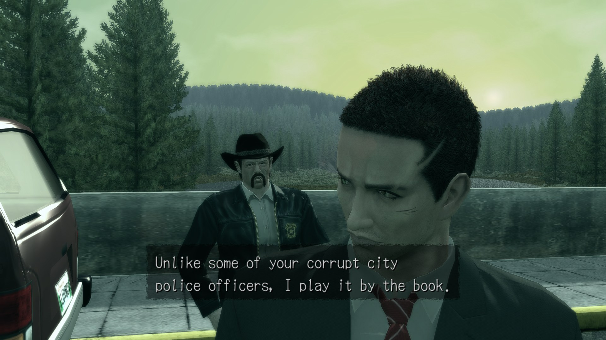

## Deadly Premonition Recompilation 1.3

The sky is fixed, FSR 3 stopped flickering, and 60 FPS runs on whole ticks like the console did. Installs in place from the launcher (Update button) or unzip over any earlier version; saves and settings are kept. Steam Deck: the in-launcher updater does not apply under Proton yet (it relies on PowerShell), so unzip the release over your folder by hand for now.

This one needs testers. Most of it is verified on one machine and one save; the notes say what to look at and where to report.

### 🌅 The sky, tree crowns and glass edges (ROV render path)
- The game renders its HDR scene in the console's 7e3 colour format, which stores **2 bits of alpha**. The game writes a smooth mask into that alpha (sky, fog, the final composite), and the console-faithful ROV path kept exactly those 2 bits: four levels, so the sky showed a stair-stepped diagonal and tree crowns and car glass had hard contours. Proven with a RenderDoc capture of the resolved scene: the alpha channel had the staircase, the colour did not.
- 1.3 keeps a **16-bit shadow alpha** next to the EDRAM buffer for every HDR sample, tagged with the sample's colour so a stale entry can never be mistaken for a fresh one. Blending, resolves and the HDR to 8-bit conversion read it. No tile bookkeeping, no format tracking - it cannot go out of sync.
- Cost: one extra dword read and write per HDR sample and about 40 MB of VRAM at 2x. Frame time difference on the test machine: within noise.
- ROV stays the default and is now the recommended path. RTV is still selectable in the launcher.

### 🎞️ FSR 3 without the flicker
- The FSR 3 presenter path was created in HDR mode with auto exposure, and its history was reset every frame. So the upscaler re-metered the brightness of every single frame from its own content: the whole image changed tint between consecutive frames, and scene cuts came with a brightness flash. On an SDR image neither flag makes sense. Both are off now, and the placeholder motion vectors are zero instead of colour data scaled to the screen size.
- If you still see frame-to-frame flicker with `fsr3`, switch Present Effect to `fsr` in the launcher and tell us which scene.

### ⏱️ 60 FPS on whole ticks (#12)
- On the console the logic tick is always a whole number of vblanks. 1.1 and 1.2 fed the game a fractional real-time tick (0.96, 1.02...), and it turned out the game's scripted dialogue scenes do not like values below 1.0 at all - they run visibly fast. The PC port of the game does the same thing we do now: whole ticks in cutscenes, with the fraction carried over.
- 1.3 hands the game **integer ticks with an error accumulator**: 1, 1, 1, ... and a 2 every few hundred frames when the accumulated real time asks for it. Measured game time to real time: 1.0000 to four decimals, no tick ever below 1.0, no drift. `dp_60fps_integer_tick = false` in `deadlyprem.toml` restores the 1.2 behaviour if you need to compare.
- SilentHeII, this is the build for the Emily / George scene: with 60 FPS on it should now stay in sync for the whole scene. Please say either way.
- `dp_60fps_stats = true` logs frame times and the game / real ratio every 10 s (`logs\deadlyprem_XXX.log`) - attach that with any timing report.

### 🔁 Doubled sounds and prop swaps at 60 FPS (#17, #18): investigated, experimental switch
- We found the game's animation event dispatcher. Every motion carries keyframe events (play sound, attach the cup to the hand, footstep...) with a start and an end frame, and the dispatcher re-picks whatever crossed or sits inside that range on every update, with no memory of what already fired. At 60 FPS that visits things twice that the 30 FPS tick used to cross in one step.
- There is an experimental hook: `dp_anim_event_dedupe = true` in `deadlyprem.toml` lets one-shot events fire only when their start frame is crossed. It is **off by default** because in our own test session every sound event was picked three times in the *same* update, a pattern the hook does not cover yet - we are still mapping who the third caller is. `dp_anim_event_log = true` writes every pick to the log; if you have the coffee or the cigarette-jar save, a log with the switch on and off would tell us more than anything else.

### 🧩 Under the hood
- Pipeline (PSO) library entries are salted with a version: the first launch after this update recompiles the pipelines once (a slower first minute, the compile indicator shows it), after that they cache again. This was needed because the shader translator changed and Direct3D refuses to store a changed pipeline under an old name.
- The audio driver logs silence fills every 10 s when they happen (`SDLAudioDriver: N silence fills`) - diagnostics for the audio loss reports (#16).
- `docs/sdk-patches` regenerated (33 tracked diffs) and now includes the XeSL sources the resolve shaders were rebuilt from, with the exact fxc commands.

### What's next
We are, in effect, decoding the game: the timing loop, the animation event system and the render passes are mapped now, with the PC port's decompilation as a cross-reference. Performance, the remaining 60 FPS event bugs, the terrain texture blending and the Steam Deck updater are the next targets.

### Known issues
- Steam Deck / Proton: the launcher's Update button downloads but does not apply (PowerShell). Unzip manually; a PowerShell-free updater is planned.
- Terrain layer blending shows hard triangle edges while walking and blends correctly when standing still (long-standing, under investigation).
- Some dialogue scenes show light-blue polygonal patches on characters with the ROV path (the scene's fog colour bleeding through the composite mask). Being investigated with RenderDoc.
- 2x internal resolution: post-process passes are sized for 1x (fine grid on bright edges, softer blur). Internal Resolution 1x does not have it.
- Clouds with hard edges (#10).
- Linux is not supported yet.
